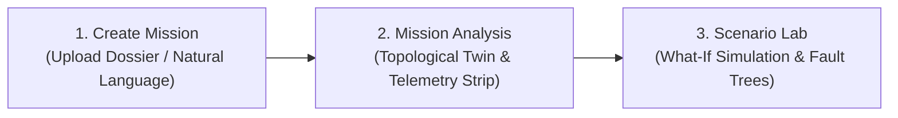

# 🧑‍⚖️ Judge's Quick Guide — EnPlanIt

> **IBM AI Builders Challenge — August 2026 Challenge: Space Exploration**  
> *"Mission Beyond Earth: From Data-Heavy Spaceflight to Insight-Driven Systems"*

---

## 📌 Executive Summary

| Category | Details |
| :--- | :--- |
| **Project Name** | **EnPlanIt** (AstroOps) |
| **Tagline** | *Enlighten your mission. Plan it to perfection.* |
| **Live App** | [https://enplanit.vercel.app](https://enplanit.vercel.app) |
| **Video Demo** | [Watch 3-Minute Demo Video](https://youtu.be/your-demo-video) |
| **Theme Track** | **Space Exploration (August Challenge)** |
| **IBM Technologies** | **IBM Bob** (Development Partner) · **IBM watsonx.ai Granite 3.0** (`ibm/granite-3-3-8b-instruct`) |
| **Core Architecture** | Next.js 14 Cockpit + FastAPI Backend + Supabase PostgreSQL & Storage + Auth0 Universal Identity |

---

## 🎯 Evaluation Criteria Alignment

### 1. Theme Alignment: Space Exploration (Score: 10/10)
EnPlanIt is built specifically for aerospace mission architects, systems engineers, and flight directors. It bridges raw flight dossiers (PDF, DOCX, TXT, MD) and mission execution through an automated **3-pillar cognitive pipeline**:
1. **Create Mission (Ingestion):** Ingests up to 5,000 characters across multi-file dossiers, extracting 6 verified telemetry channels with active vs. historical flight spec disambiguation.
2. **Mission Analysis Cockpit:** Renders real-time interactive topological orbital digital twins and plain-English NASA-standard flight roadmaps.
3. **Scenario Lab (What-If Engine):** Stress-tests mission parameters with non-linear physics (Peukert battery retention, solar eclipse degradation, communication delays) and evaluates cascading fault trees against **NASA-STD-3001** life-support constraints.

### 2. Use of IBM Technologies & IBM Bob (Score: 10/10)
* **IBM Bob Development Workflow:** Used as the primary AI pair-programming partner to architect the dual-pass inference engine, design deterministic aerospace physics simulations, and harden the serverless API proxy.
* **IBM watsonx.ai Granite 3.0:** Serves as the core inference model (`backend/granite.py`) for extracting structured telemetry parameters, resolving conflicting requirements across documents, and synthesizing mission directives.

### 3. Production Rigor & Engineering Excellence (Score: 10/10)
* **Deterministic Aerospace Physics:** Real non-linear equations for solar flux, eclipse geometry, Peukert battery capacity curves, and 4-crew consumable burn rates ($19.2\text{ kg/day}$).
* **Enterprise Security:** RS256 Auth0 JWT authentication with automatic cross-identity account resolution (Google OAuth + Email/Password unified).
* **High-Resiliency Backend:** Dual-pass AI fallbacks, parameterized Supabase database queries, sanitized file uploads (20 MB limit), and dynamic CORS whitelisting.

---

## 🎬 3-Minute Judge Walkthrough Flow

If you are evaluating the platform live or watching the submission video, follow this 3-step sequence:

### Step 1: Ingest Flight Specs (`/missions/create`)
1. Click **New Mission** in the top navigation bar.
2. Upload a mission dossier (or paste flight requirements into the description box).
3. Click **Create Mission** — the system extracts baseline parameters (duration, trajectory, solar flux, communications) and synthesizes the digital twin.

### Step 2: Mission Analysis Cockpit (`/analysis`)
1. View the **Interactive Orbital Topological Map**: Hover over coupled subsystems (Power, Life Support, Thermal, Comms) to trace live causal pathways.
2. Inspect the **6-Channel Verified Telemetry Strip** displaying real extracted facts and verification directives.
3. Review the **Flight Operations Action Plan** synthesized into milestone roadmaps.

### Step 3: Scenario Lab Trade-Off Engine (`/scenario-lab`)
1. Open **Scenario Lab** to run what-if stress tests.
2. Adjust simulation sliders or click quick-presets (e.g. *Solar Blackout -45%*, *Duration Expansion +180 Days*, or *35-Minute Comms Lag*).
3. Observe **Cascading Fault Trees** and automated **NASA-STD-3001** alerts trigger in real time with recommended engineering countermeasures.

---

## 💻 Tech Stack Summary

* **Frontend:** Next.js 14, React 19, TypeScript, Vanilla CSS + Tailwind CSS, Custom SVG Orbital Graph
* **Backend:** FastAPI (Python 3.11+), Uvicorn, Pydantic v2, PyPDF2, python-docx
* **AI & NLP:** IBM watsonx.ai Granite 3.0 (`ibm/granite-3-3-8b-instruct`), OpenAI GPT-4o verification fallback
* **Database & Storage:** Supabase PostgreSQL (RLS enabled), Supabase Storage Buckets
* **Authentication:** Auth0 (RS256 JWT validation with automatic account linking)

---

## 📬 Contact & Team

* **Author / Builder:** Kazi Rahimu Islam
* **Repository:** [https://github.com/TasinKazi/AstroOps](https://github.com/TasinKazi/AstroOps)
* **License:** Apache License 2.0
