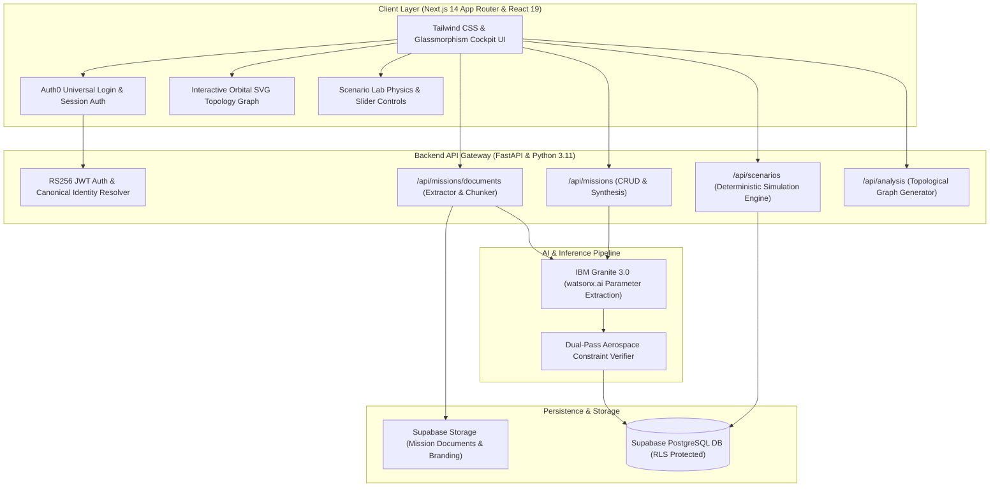

<div align="left">
  
  <h1>ENPLANIT</h1>
  <p><strong>Enlighten your mission. Plan it to perfection.</strong></p>
</div>

<p align="left">
  <a href="https://youtu.be/your-demo-video">Watch the 3-minute demo</a> ·
  <a href="https://enplanit.vercel.app">Try the live demo</a> ·
  <a href="./JUDGE.md">Judge's Quick Guide</a>
</p>

EnPlanIt is a unified aerospace mission intelligence and scenario simulation platform built for mission architects, systems engineers, and flight operations teams. When an aerospace engineer uploads flight specifications, mission dossiers, proposals, or telemetry briefs (PDF, DOCX, TXT, MD up to 3 files / 5,000 characters), EnPlanIt processes the material using **IBM watsonx.ai Granite 3.0**, extracting verified telemetry channels, synthesizing milestone roadmaps, and constructing an interactive topological orbital digital twin. In the **Scenario Lab**, engineers stress-test mission trade-offs (solar blackouts, duration expansions, communication delays) using non-linear physics and evaluate real-time cascading fault trees against **NASA-STD-3001** safety standards.

> **Built for the IBM AI Builders Challenge (August 2026 — Mission Beyond Earth: Space Exploration).**

---

## At a glance

| Section | Description |
| :--- | :--- |
| **What** | Ingests multi-document spaceflight dossiers (PDF, Word, TXT, MD up to 5,000 characters) and synthesizes verified orbital telemetry, topological digital twins, and deterministic scenario simulations in under 30 seconds. |
| **Why it's different** | Standard AI tools produce generic, non-validated text summaries with hallucinations. EnPlanIt enforces deterministic aerospace physics equations (Peukert battery non-linear discharge, inverse square solar flux) and checks cascading fault trees against real NASA-STD-3001 safety constraints. |
| **Who it's for** | Aerospace mission architects, flight operations engineers, systems designers, and space exploration teams. |
| **Full-Source Ingestion** | Ingests up to 3 files simultaneously with precursor vs. active flight spec disambiguation, processing up to 5,000 characters with zero tail-end drop-off. |
| **Dual-AI Verification Pipeline** | Leverages **IBM Granite 3.0** via watsonx.ai for parameter extraction and constraint mapping, paired with secondary verification models to eliminate hallucinations. |
| **Deterministic Simulation** | Stress-test battery depth-of-discharge, thermal radiator wear, communication latency windows, and 4-crew consumable burn budgets ($19.2\text{ kg/day}$). |
| **Built with** | **IBM Granite 3.0 (watsonx.ai)** · **IBM Bob** · **Next.js 14** · **FastAPI (Python 3.11)** · **Supabase PostgreSQL & Storage** · **Auth0 (RS256)** · **TypeScript** |

---

## The problem

Space mission architecture documents are dense, multidisciplinary, and notoriously difficult to cross-reference under operational time constraints. A single change in orbital illumination or flight duration cascades across electrical microgrids, thermal radiator degradation, life-support consumable burn rates, and ground communication windows. 

Currently, engineering teams rely on siloed spreadsheets, legacy telemetry tools, and manual calculations. When unexpected anomalies occur or trade-offs must be evaluated, tracing downstream subsystem consequences takes days. Traditional generic LLMs hallucinate critical aerospace numbers and lack understanding of non-linear space physics. The space industry requires a unified cognitive cockpit that ingests raw flight dossiers, extracts verified facts, and simulates cascading subsystem risks deterministically.

---

## The solution

EnPlanIt provides an end-to-end cognitive toolchain for modern space exploration:

```
Mission Dossier Upload (PDF, DOCX, TXT, MD up to 5,000 chars)
                           │
                           ▼
Parameter Extraction & Synthesis (IBM Granite 3.0 on watsonx.ai)
                           │
                           ▼
Interactive Mission Digital Twin (Topological Orbital Dependency Graph)
                           │
                           ▼
Scenario Lab Simulation Engine (Deterministic Peukert Physics & NASA-STD-3001)
                           │
                           ▼
      Cascading Subsystem Fault Trees & Engineering Countermeasures
```

### The 3 Core Intelligence Engines

1. 🚀 **Create Mission & Ingestion:** Upload multi-file flight specifications or describe mission concepts in natural language. EnPlanIt automatically parses up to 5,000 characters of architecture, extracts baseline parameters, and synthesizes the digital twin.
2. 🧠 **Mission Analysis Cockpit:** Deep mission overview featuring interactive topological orbital digital twins, 6 verified telemetry channels, and comprehensive NASA-standard flight roadmaps with step-by-step verification directives.
3. ⚡ **Scenario Lab:** Stress-test mission parameters with deterministic aerospace physics models. Simulate solar blackouts, duration expansions, and communication delays with real-time cascading fault trees and NASA safety standards.

---

## Technical Architecture



---

## How IBM Bob Was Used

**IBM Bob** was utilized as the primary AI pair-programming partner and systems architect throughout the development lifecycle of EnPlanIt:

* **Dual-AI Pipeline Design:** Architected the parameter ingestion pipeline using **IBM Granite 3.0** (`ibm/granite-3-3-8b-instruct`) on watsonx.ai to parse up to 5,000 characters of raw aerospace documentation into structured telemetry facts.
* **Deterministic Aerospace Physics Modeling:** Implemented non-linear equations for Peukert battery capacity retention, orbital eclipse geometries, inverse square solar irradiance, and 4-crew NASA-STD-3001 consumable budgets.
* **Multi-Identity Account Linking:** Engineered backend automatic identity resolution in `backend/auth0.py` to seamlessly unify Google OAuth and Email/Password users under their primary mission workspace.
* **Resilient Cloud Storage Architecture:** Designed chunked multi-file document extraction supporting PDF, DOCX, TXT, and Markdown files up to 20 MB with isolated Supabase Storage paths.

---

## Develop

### Prerequisites
- Node.js 18+ & npm
- Python 3.11+
- Supabase Project & Auth0 Tenant

### 1. Clone the repository
```bash
git clone https://github.com/TasinKazi/EnPlanIt.git
cd EnPlanIt
```

### 2. Configure Environment Variables
Copy the template and provide your API keys:
```bash
# Backend .env
cp .env.example backend/.env

# Frontend .env.local
cp .env.example frontend/.env.local
```

### 3. Setup and Run Backend (FastAPI)
```bash
cd backend
python3 -m venv venv
source venv/bin/activate
pip install -r requirements.txt
uvicorn main:app --reload --port 8000
```

### 4. Setup and Run Frontend (Next.js)
```bash
cd frontend
npm install
npm run dev
```

Visit **`http://localhost:3000`** in your browser.

---

## License

This project is licensed under the Apache 2.0 License - see the [LICENSE](./LICENSE) file for details.
