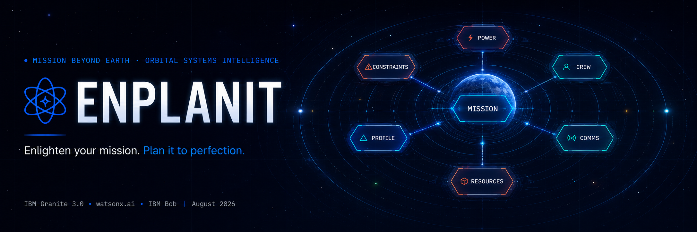
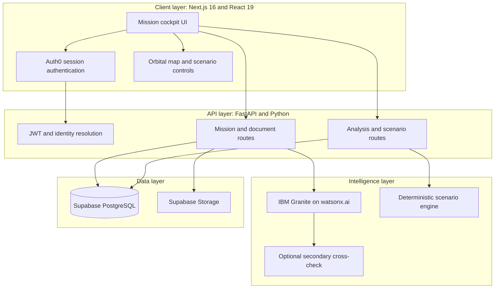

# ENPLANIT

**Enlighten your mission. Plan it to perfection.**

EnPlanIt is a unified aerospace mission intelligence and scenario simulation platform for mission architects, systems engineers, mission risk and safety analysts, flight operations teams, and space exploration enthusiasts. It transforms mission concepts and uploaded flight dossiers into structured mission profiles, interactive subsystem maps, milestone roadmaps, and deterministic what-if simulations.

> **Built for the IBM AI Builders Challenge (August 2026, Mission Beyond Earth: Space Exploration).**

[Try the live demo](https://enplanit.vercel.app) · [Judge's Quick Guide](./JUDGE.md)

---

## At a glance

| Section | Description |
| :--- | :--- |
| **What** | Converts mission concepts and supporting documents into structured mission intelligence, interactive subsystem maps, roadmaps, and scenario simulations. |
| **Why it is different** | Combines AI-assisted information extraction with deterministic calculations, allowing users to explore subsystem consequences without relying on AI-generated numbers alone. |
| **Who it is for** | Mission architects, systems engineers, mission risk and safety analysts, flight operations teams, and space exploration enthusiasts. |
| **Document support** | Accepts up to three PDF, DOCX, TXT, or Markdown files, with a maximum size of 20 MB per file. The current prototype uses an analysis context of up to 5,000 extracted characters where applicable. |
| **Verification pipeline** | Uses IBM Granite through watsonx.ai for initial extraction and can apply a secondary AI cross-check designed to reduce unsupported or incorrectly extracted values. |
| **Scenario simulation** | Evaluates changes involving power availability, battery reserves, mission duration, communication delay, crew resources, and environmental constraints. |
| **Built with** | **IBM Granite on watsonx.ai** · **IBM Bob** · **OpenAI (optional verifier)** · **Next.js 16** · **React 19** · **Tailwind CSS v4** · **FastAPI** · **Supabase** · **Auth0** · **TypeScript** · **Python** |

---

## The problem

Space mission documentation is dense, multidisciplinary, and distributed across proposals, flight specifications, telemetry briefs, safety requirements, and operational plans. A change to one mission parameter can affect several connected systems. Reduced solar exposure can influence power generation and battery reserves, while a longer mission can alter crew consumables, radiation exposure, maintenance needs, and communication planning.

These relationships are often reviewed through separate documents, spreadsheets, and specialized tools. General-purpose AI assistants can summarize documents, but summaries alone do not provide a structured model of mission dependencies or a reliable method for calculating downstream effects. Mission teams need a faster way to organize source material, identify missing parameters, visualize subsystem relationships, and test proposed changes.

---

## The solution

EnPlanIt provides an integrated workflow for transforming mission documentation into explorable mission intelligence.

### Three core intelligence engines

1. **Mission Creation and Ingestion:** Users can describe a mission concept in natural language or upload supporting PDF, DOCX, TXT, and Markdown documents. EnPlanIt extracts relevant mission facts, identifies unspecified information, and constructs a structured mission profile.

2. **Mission Analysis Cockpit:** The cockpit presents mission parameters, milestone roadmaps, verified and unverified telemetry channels, subsystem relationships, and an interactive orbital dependency map.

3. **Scenario Lab:** Users can change mission conditions such as solar availability, mission duration, power demand, or communication delay. EnPlanIt applies deterministic calculations and displays affected subsystems, cascading risks, and recommended investigation steps.

---

## What makes EnPlanIt different

### AI-assisted extraction with deterministic analysis

EnPlanIt uses AI to organize unstructured mission information, but scenario calculations are handled separately through explicit engineering logic. This separation reduces the risk of presenting an AI-generated estimate as a calculated result.

### Interactive mission dependency model

Instead of returning only a narrative summary, EnPlanIt creates an explorable subsystem map that connects mission conditions, power, communications, crew, constraints, and resources.

### Source-aware mission facts

Mission facts can retain their source document, page reference, confidence state, and verification status. Missing or unsupported values are presented as planning gaps rather than silently treated as confirmed facts.

### Cascading scenario consequences

The Scenario Lab shows how one change can propagate through multiple mission systems. Users can compare baseline and modified conditions while reviewing risk pathways and potential countermeasures.

---

## Technical architecture



### Architecture breakdown

| Layer | Responsibility |
| :--- | :--- |
| **Frontend** | Next.js App Router interface, mission dashboards, document uploads, authentication flows, orbital visualizations, and scenario controls. |
| **Backend** | FastAPI routes for missions, documents, analysis, insights, profiles, authentication, and deterministic scenario calculations. |
| **AI pipeline** | IBM Granite on watsonx.ai performs mission parameter extraction and synthesis. When configured, a secondary model can cross-check the preliminary extraction. |
| **Data and storage** | Supabase PostgreSQL stores application data, while Supabase Storage manages uploaded mission documents. |
| **Authentication** | Auth0 provides session authentication, while backend identity-resolution logic connects authenticated users to their EnPlanIt workspaces. |

---

## Repository structure

| Path | Purpose |
| :--- | :--- |
| `frontend/app/` | Next.js pages, layouts, authentication routes, dashboards, mission creation, analysis, and Scenario Lab. |
| `frontend/components/` | Shared interface components, mission visualizations, navigation, document tools, and scenario displays. |
| `frontend/lib/` | Frontend API clients, authentication helpers, and shared application logic. |
| `frontend/public/` | Logos, banner artwork, and other static assets. |
| `backend/routers/` | FastAPI endpoints for missions, documents, analysis, scenarios, authentication, profiles, and insights. |
| `backend/ai_client.py` | AI-provider configuration, Granite requests, fallback behavior, extraction, and verification logic. |
| `backend/document_extractor.py` | Text extraction and normalization for supported document formats. |
| `api/index.py` | Vercel serverless entry point for the FastAPI application. |
| `supabase/schema.sql` | Database schema and supporting Supabase configuration. |
| `JUDGE.md` | Condensed project guide for challenge reviewers. |

---

## How IBM Bob was used

IBM Bob served as an AI pair-programming partner and systems-design assistant throughout the development of EnPlanIt.

- **AI Pipeline Architecture:** Helped design the mission-parameter extraction flow using IBM Granite on watsonx.ai, structured JSON outputs, and an optional second-pass cross-check.

- **Deterministic Scenario Modeling:** Supported the implementation of explicit calculations for battery reserves, solar availability, communication delay, mission duration, radiation exposure, and crew-resource planning.

- **Mission Dependency Visualization:** Assisted with the interactive orbital map and the representation of relationships between power, communications, crew, constraints, resources, and mission objectives.

- **Authentication and Identity Resolution:** Helped develop backend logic that connects Auth0 identities and preserves access to the correct mission workspace across supported sign-in methods.

- **Document and Storage Workflow:** Supported multi-document extraction, Supabase Storage integration, file validation, and isolated document paths.

- **Interface Development and Debugging:** Assisted with the Next.js cockpit interface, responsive styling, API integration, debugging, and deployment preparation.

---

## Local development

### Prerequisites

- Node.js 20.9 or later
- npm
- Python 3.11 or later
- A Supabase project
- An Auth0 tenant
- IBM watsonx.ai credentials
- An OpenAI API key if the optional secondary verification stage is enabled

### 1. Clone the repository

```bash
git clone https://github.com/KaziRahimu123/EnPlanIt.git
cd EnPlanIt
```

### 2. Configure environment variables

Copy the unified environment template into the backend and frontend locations:

```bash
cp .env.example backend/.env
cp .env.example frontend/.env.local
```

Update both files with the credentials and URLs required by your environment. Never commit populated environment files or secrets.

### 3. Start the FastAPI backend

Open a terminal from the repository root:

```bash
cd backend
python3 -m venv .venv
source .venv/bin/activate
pip install -r requirements.txt
uvicorn main:app --reload --port 8000
```

The backend runs at `http://localhost:8000`. FastAPI documentation is available at `http://localhost:8000/docs` when enabled.

### 4. Start the Next.js frontend

Open a second terminal from the repository root:

```bash
cd frontend
npm ci
npm run dev
```

Open `http://localhost:3000` in your browser.

---

## Prototype notice

EnPlanIt is a challenge prototype intended for mission-planning exploration, education, and scenario analysis. It is not a certified aerospace engineering or flight-safety system. Its outputs should be independently verified before they are used in operational, safety-critical, or mission-critical decisions.

---

## License

This project is licensed under the Apache License 2.0. See [LICENSE](./LICENSE) for details.

---

## License

This project is licensed under the Apache License 2.0. See [LICENSE](./LICENSE) for details.
