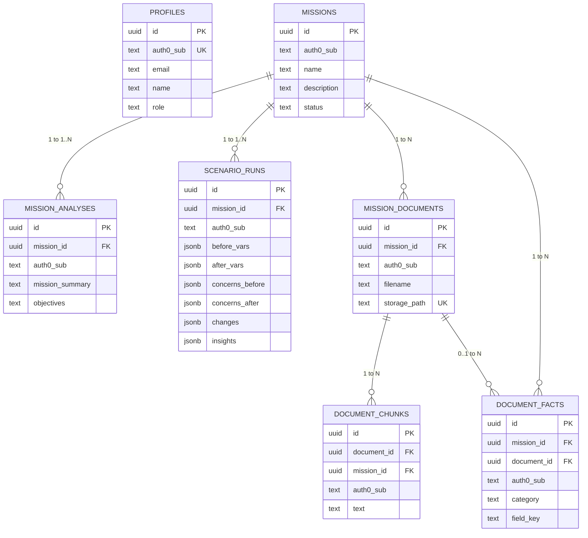

# Supabase Database & Migrations Guide — EnPlanIt

This directory manages the PostgreSQL schema, indexes, constraints, and Row-Level Security (RLS) policies for the **EnPlanIt** platform.

---

## 1. Migration Execution Order

When applying database changes to Supabase (via Supabase CLI or SQL Editor in Dashboard), run migrations in chronological order:

```text
supabase/migrations/
└── 20260828000000_reconcile_schema.sql  <-- Primary reconciliation migration
```

### Applying via Supabase CLI
```bash
# Link your Supabase project (if not already linked)
supabase link --project-ref <your-project-ref>

# Push all pending migrations
supabase db push
```

### Applying via Supabase Dashboard SQL Editor
1. Open the [Supabase Dashboard](https://app.supabase.com).
2. Navigate to **SQL Editor** -> **New Query**.
3. Paste the contents of `supabase/migrations/20260828000000_reconcile_schema.sql` (or `supabase/schema.sql`).
4. Click **Run**.

---

## 2. Table Relationship Hierarchy



---

## 3. Row-Level Security (RLS) Policies

All tables have RLS enabled with strict `auth0_sub` tenant isolation policies:
- **`profiles`**: Users can read/manage only their own profile row.
- **`missions`**: Users can create, read, update, delete only their own missions.
- **`mission_analyses`**: Bound to owner via `auth0_sub` and `mission_id` cascade.
- **`scenario_runs`**: Bound to owner via `auth0_sub` and `mission_id` cascade.
- **`mission_documents`**, **`document_chunks`**, **`document_facts`**: Strict ownership isolation.

---

## 4. Key Security Rules
1. **Service Role Key**: The `SUPABASE_SERVICE_ROLE_KEY` is strictly for backend server-side operations (FastAPI). It must **never** be exposed with a `NEXT_PUBLIC_` prefix or shipped in client bundles.
2. **Anonymous / Client Access**: Read and write access from clients is restricted by RLS policies.
